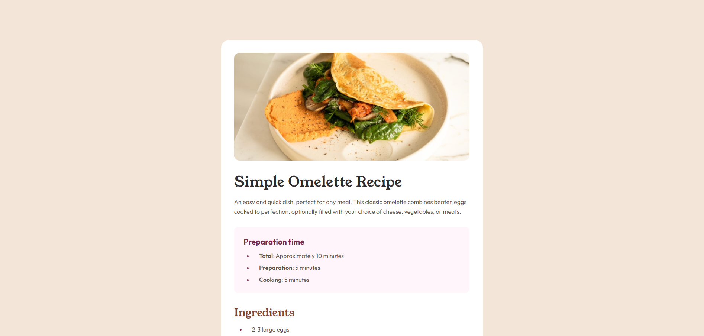
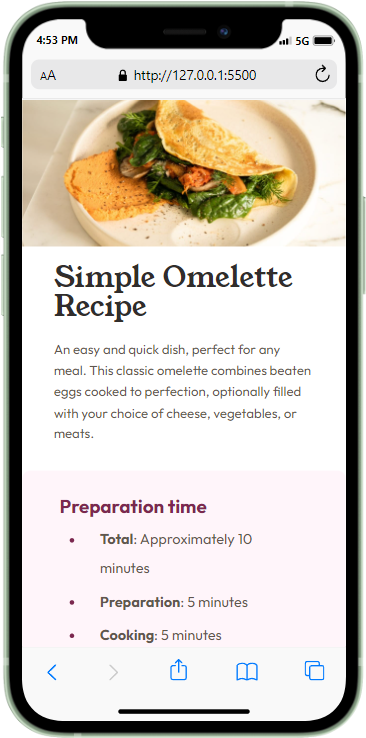

# Frontend Mentor - Recipe page solution

This is a solution to the [Recipe page challenge on Frontend Mentor](https://www.frontendmentor.io/challenges/recipe-page-KiTsR8QQKm). Frontend Mentor challenges help you improve your coding skills by building realistic projects.

## Table of contents

- [Frontend Mentor - Recipe page solution](#frontend-mentor---recipe-page-solution)
  - [Table of contents](#table-of-contents)
  - [Overview](#overview)
    - [Screenshot](#screenshot)
    - [Links](#links)
  - [My process](#my-process)
    - [Built with](#built-with)
    - [What I learned](#what-i-learned)
  - [Author](#author)

## Overview

### Screenshot

### Links

- Solution URL: [https://github.com/Kaloyan-Kostov/Frontend-Mentor-Recipe-Page](https://kaloyan-kostov.github.io/Frontend-Mentor-Recipe-Page)

## My process

### Built with

- Semantic HTML5 markup
- CSS rules

### What I learned

It took me some time to get all of the small details resemble the design as closely as possible.

## Author

- GitHub - [Kaloyan-Kostov](https://github.com/Kaloyan-Kostov)
- Frontend Mentor - [@Kaloyan-Kostov](https://www.frontendmentor.io/profile/Kaloyan-Kostov)
